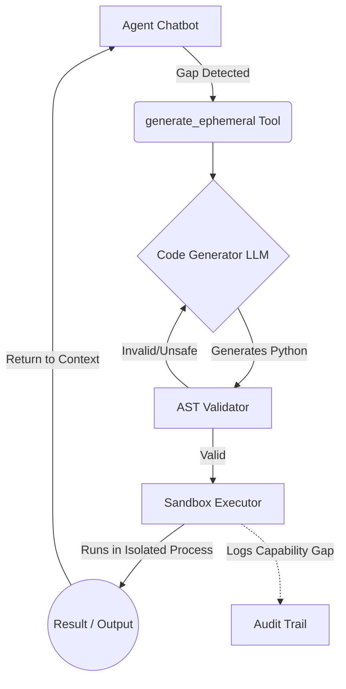

# ShopSense: E-Commerce Price Intelligence Agent

A multi-turn conversational agent built with [LangGraph](https://langchain-ai.github.io/langgraph/)
and Azure OpenAI, hosted via the **responses** protocol.

## What it demonstrates

- **ShopSense Agent**: An E-Commerce Price Intelligence agent that handles complex shopping queries.
- **LangGraph Agent Graph**: Advanced graph routing with a 2-Tier waterfall architecture.
- **Dynamic Tool Generation**: The ability to synthesize, validate, and securely execute Python code on the fly for unhandled calculations.
- **Server-side Conversation State** via `previous_response_id` — no application-side session storage.
- **Streaming Output** over the responses protocol.
- **Azure OpenAI** with `DefaultAzureCredential` authentication.

## High-Level Design (HLD)

The agent utilizes a **2-Tier Waterfall Architecture** for robust tool execution and fallback logic:

- **Tier 1 (Static Tools)**: Predefined tools (like `fetch`, `memory`) directly available to the LLM.
- **Tier 2 (Ephemeral Synthesis)**: If a request requires custom logic or calculations not covered by static tools, the agent triggers an on-the-fly code generation pipeline.

### Ephemeral Synthesis Pipeline

When the agent requires a dynamic calculation, it invokes the `generate_ephemeral` tool, which triggers the following workflow:

1. **Code Generation**: A dedicated LLM generates a type-hinted, self-contained Python script to solve the specific task.
2. **AST Validation**: The code is parsed to an Abstract Syntax Tree to block dangerous imports (`os`, `sys`) and built-ins (`exec`, `eval`). If validation fails, it loops back to the LLM for a correction (up to 2 retries).
3. **Sandbox Execution**: The validated code runs in an isolated subprocess with stripped environment variables and a strict 30-second CPU timeout.

## Key difference from invocations protocol

This sample uses the **responses** protocol where conversation history is
managed server-side. The platform stores conversation state and resolves it
via `previous_response_id` — no need for an in-memory session store.

## Prerequisites

- Python 3.12+
- Azure OpenAI resource with a deployed model (e.g., `gpt-4.1-mini`)
- Azure CLI login (`az login`) or other `DefaultAzureCredential` source

## Environment variables

| Variable | Required | Default | Description |
|---|---|---|---|
| `FOUNDRY_PROJECT_ENDPOINT` | Yes | — | Foundry project endpoint URL |
| `AZURE_AI_MODEL_DEPLOYMENT_NAME` | Yes | — | Model deployment name declared in `agent.manifest.yaml` |

## Azure AI Foundry Capability Usage

ShopSense relies on several core capabilities provided by Azure AI Foundry and the **responses** protocol:

- **Server-Side State Management**: Rather than maintaining a local database or forcing the client to pass the entire message history on every turn, ShopSense leverages Foundry's server-side memory. Conversations are chained purely via `previous_response_id`.
- **Azure Identity Authentication**: Uses `DefaultAzureCredential` for seamless identity resolution against the target Azure OpenAI model.
- **AI Agent Hosting**: Configured via `agent.yaml` for direct deployment as a containerized endpoint within Foundry's serverless AI Agent Hosting environment.
- **Streaming Telemetry & Logs**: Fully integrated with Foundry's remote monitor for real-time observability of the agent's LLM routing, tool execution, and Ephemeral Synthesis pipelines.
